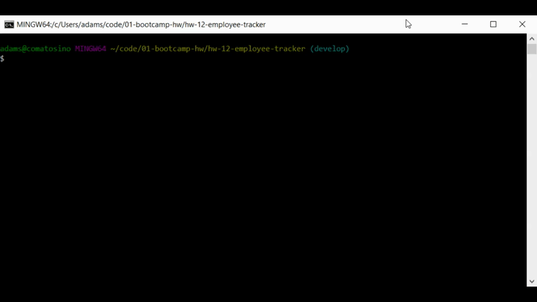

 [](https://opensource.org/licenses/MIT)
# Employee Tracker

## Description

This application utilizes MySql and Inquirer to read and update employee, role, and department information in a database.

Click the gif below to see a video demo!

[](https://drive.google.com/file/d/1eCx1ITDIWLTwsx-tIBMbdGKAru4zVH19/view)

## Table of Contents

- [Installation](#installation)
- [Usage](#usage)
- [Contributing](#Contributing)
- [Testing](#Testing)
- [Questions](#Questions)
- [License](#License)

## Installation
```
npm i
```
## Usage
```
npm start
```
## Contributing

Contact me at one of the links below if you would like to contribute!

## Testing

No tests specified currently

## Questions

Questions? Reach out to me:

GitHub: [comatosino](https://github.com/comatosino)

Email: adamsiii.robert@gmail.com

## License
    
This project is covered under the [MIT](https://opensource.org/licenses/MIT) license.
    
